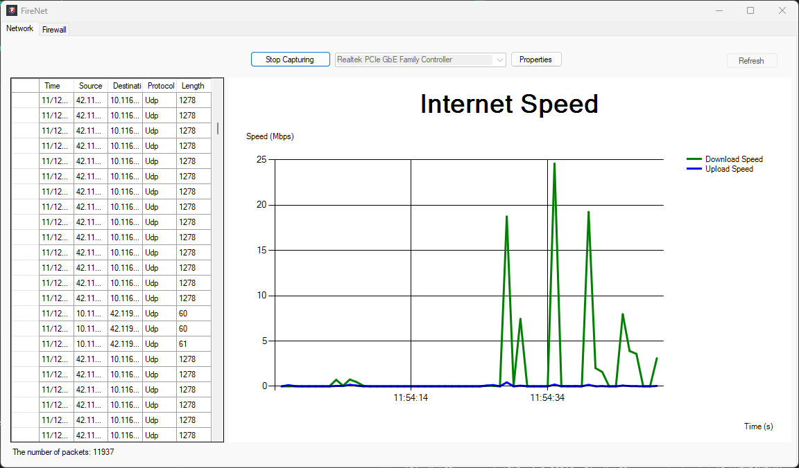

# FireNet
Project III - An User-friendly Network Monitoring App

## Dependencies
- .NET Framework 8.0
- WinPcap or Npcap

## Demonstration

## How to use
- Open Task Manager *(Ctrl + Shift + Esc)* -> Performance to see which network device you using.
- Select that correspond device in the app.
- Press "Start Capturing" (also can press "Properties" to see which detail of the device).